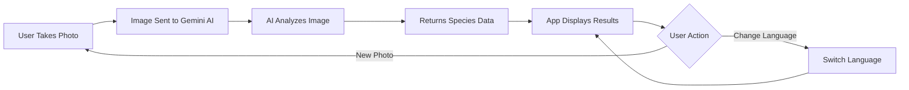

# 🐾 Species Identifier

**AI-powered mobile app for identifying animals and insects**

A beautiful, bilingual React Native application that uses Google's Gemini AI to identify species from photos. Built with Expo and featuring full Ukrainian 🇺🇦 and English 🇬🇧 language support.

[](https://opensource.org/licenses/MIT)
[](https://reactnative.dev/)
[](https://expo.dev/)
[](https://www.typescriptlang.org/)

---

## ✨ Features

- 📸 **Camera & Gallery Support** - Take photos or choose from your library
- 🤖 **AI-Powered Identification** - Uses Google Gemini AI for accurate species recognition
- 🌍 **Bilingual Interface** - Full support for Ukrainian and English languages
- 📚 **Detailed Information** - Scientific names, classification, habitat, diet, behavior, conservation status
- 💾 **Persistent Preferences** - App remembers your language choice
- 🎨 **Modern UI** - Clean, elegant design with dark mode support
- 🔒 **Privacy-Focused** - Photos are processed in real-time and not stored
- 📱 **Cross-Platform** - Works on iOS, Android, and Web

---

## 📱 Screenshots

<table>
  <tr>
    <td></td>
    <td></td>
    <td></td>
    <td></td>
  </tr>
  <tr>
    <td align="center"><b>Home Screen</b><br/>Main identifier interface</td>
    <td align="center"><b>Success Result</b><br/>Detailed species info</td>
    <td align="center"><b>Error Handling</b><br/>User-friendly errors</td>
    <td align="center"><b>About & Settings</b><br/>Language switcher</td>
  </tr>
</table>

---

## 🚀 Getting Started

### Prerequisites

- [Node.js](https://nodejs.org/) (v18 or higher)
- [npm](https://www.npmjs.com/) or [yarn](https://yarnpkg.com/)
- [Expo CLI](https://docs.expo.dev/get-started/installation/)
- iOS Simulator (macOS) or Android Emulator
- **Google AI API Key** (required) - [Get it here](https://makersuite.google.com/app/apikey)

### Installation

1. **Clone the repository**
   ```bash
   git clone https://github.com/yourusername/species-identifier.git
   cd species-identifier
   ```

2. **Install dependencies**
   ```bash
   npm install
   ```

3. **Set up your Google AI API Key**
   
   - Get your free API key from [Google AI Studio](https://makersuite.google.com/app/apikey)
   - Open `.env`
   - Add the API key:
     EXPO_PUBLIC_GOOGLE_AI_API_KEY=YOUR_GOOGLE_AI_API_KEY_HERE;

4. **Start the development server**
   ```bash
   npx expo start
   ```

5. **Run the app**
   - Press `i` for iOS Simulator
   - Press `a` for Android Emulator
   - Scan QR code with [Expo Go](https://expo.dev/go) app on your device

---

## 🎯 How to Use

1. **Open the app** - You'll see the main identifier screen
2. **Take or choose a photo**:
   - Tap **"Зробити Фото"** (Take Photo) to use camera
   - Tap **"Вибрати з Галереї"** (Choose from Library) for existing photos
3. **Wait for AI analysis** - Usually takes 2-5 seconds
4. **View results** - See detailed information about the identified species
5. **Switch language** - Go to About tab (ℹ️) and tap 🇺🇦 UA or 🇬🇧 EN

### Tips for Best Results

✅ Take clear, well-lit photos  
✅ Keep the subject in focus  
✅ Make the animal/insect the main subject  
✅ Try different angles if first attempt fails  
❌ Avoid blurry or dark images  

---

## 🛠️ Tech Stack

| Technology | Purpose |
|------------|---------|
| [React Native](https://reactnative.dev/) | Cross-platform mobile framework |
| [Expo](https://expo.dev/) | Development platform & build tools |
| [TypeScript](https://www.typescriptlang.org/) | Type-safe JavaScript |
| [Google Gemini AI](https://ai.google.dev/) | Species identification engine |
| [Expo Router](https://docs.expo.dev/router/introduction/) | File-based navigation |
| [AsyncStorage](https://react-native-async-storage.github.io/async-storage/) | Persistent storage |
| [Expo Image Picker](https://docs.expo.dev/versions/latest/sdk/imagepicker/) | Camera & gallery access |
| [React Context API](https://react.dev/reference/react/createContext) | State management |

---

## 📂 Project Structure

```
mobile-app/
├── app/                          # App screens (Expo Router)
│   ├── (tabs)/                   # Tab navigation screens
│   │   ├── index.tsx            # 📸 Main identifier screen
│   │   ├── explore.tsx          # ℹ️ About & language switcher
│   │   └── _layout.tsx          # Tab navigation setup
│   └── _layout.tsx              # Root layout & providers
│
├── components/                   # Reusable UI components
│   ├── animal-icon.tsx          # 🐾 Custom paw print icon
│   ├── identification-result.tsx # 📊 Results display
│   ├── image-picker-button.tsx  # 📷 Camera/gallery button
│   ├── language-switcher.tsx    # 🌍 Language toggle
│   └── ...
│
├── constants/
│   └── translations.ts          # 🌍 EN/UK translations (65+ strings)
│
├── contexts/
│   └── language-context.tsx     # 🔄 Global language state
│
├── services/
│   └── identifier.ts            # 🤖 AI identification service
│
├── screenshots/                  # 📸 README images
│   └── README.md                # Screenshot guidelines
│
└── docs/
    └── development/             # 📚 Development documentation
```

---

## 🌍 Language Support

The app is **fully bilingual** with Ukrainian as the default language.

### Supported Languages

| Language | Code | Coverage | Default |
|----------|------|----------|---------|
| 🇺🇦 Ukrainian | `uk` | 100% | ✅ Yes |
| 🇬🇧 English | `en` | 100% | No |

### Features

- ✅ **65+ translated strings** covering entire UI
- ✅ **AI responses** in selected language
- ✅ **Persistent preference** via AsyncStorage
- ✅ **Instant switching** without app restart
- ✅ **Type-safe translations** with TypeScript

### Adding New Languages

Want to add Polish, Spanish, or another language?

1. **Update translations**:
   ```typescript
   // constants/translations.ts
   export type Language = 'en' | 'uk' | 'pl';  // Add new code
   
   pl: {
     appTitle: 'Identyfikator Gatunków',
     takePhoto: 'Zrób Zdjęcie',
     // ... add all 65+ translations
   }
   ```

2. **Add language button**:
   ```tsx
   // components/language-switcher.tsx
   <TouchableOpacity onPress={() => setLanguage('pl')}>
     <ThemedText>🇵🇱 PL</ThemedText>
   </TouchableOpacity>
   ```

---

## 🔧 Configuration

### Environment Variables (Optional)

For better security, you can use environment variables:

1. Create `.env` file:
   ```env
   GOOGLE_AI_API_KEY=your_api_key_here
   ```

2. Update `services/identifier.ts`:
   ```typescript
   const API_KEY = process.env.GOOGLE_AI_API_KEY || 'fallback_key';
   ```

3. Add to `.gitignore`:
   ```
   .env
   ```

### API Rate Limits

Google AI free tier includes:
- ✅ 15 requests/minute
- ✅ 1,500 requests/day
- ✅ 1M tokens/minute

Perfect for personal use! 🎉

---

## 📸 How It Works



**Detailed Flow:**

1. User takes/selects photo → Image encoded to base64
2. Sent to Google Gemini AI with structured prompt
3. AI identifies species and extracts information
4. Response parsed into structured JSON
5. App displays:
   - Common & scientific names
   - Classification (Kingdom → Species)
   - Habitat, diet, behavior
   - Conservation status
   - Interesting facts
   - Confidence level

---

## 🎨 Design Features

- **🎨 Modern Typography** - Clean, readable fonts with proper hierarchy
- **💚 Emerald Theme** - Nature-inspired color palette (#10b981)
- **✨ Smooth Animations** - Haptic feedback & transitions
- **🌙 Dark Mode** - Automatic theme adaptation
- **📱 Responsive** - Works on all screen sizes
- **🎯 Minimalist Navigation** - Icon-only bottom tabs

---

## 🧪 Development

### Available Scripts

```bash
# Start development server
npm start

# Run on specific platform
npm run ios
npm run android
npm run web

# Type checking
npx tsc --noEmit

# Clear cache & restart
npx expo start --clear
```

### Testing

```bash
# Test on iOS Simulator
npx expo start --ios

# Test on Android Emulator
npx expo start --android

# Test on physical device
# Scan QR code with Expo Go app
```

---

## 🚧 Troubleshooting

### API Key Issues

**Error:** "API Key Error" or "Invalid API Key"

✅ **Solution:**
- Verify key is correct in `services/identifier.ts`
- Check key is active in [Google AI Studio](https://makersuite.google.com/app/apikey)
- Ensure no extra spaces or quotes

### Permission Issues

**Error:** "Camera Permission Denied"

✅ **Solution:**
- Grant permissions when prompted
- Check Settings → App → Permissions
- Restart app after granting permissions

### Identification Fails

**Error:** "Could not identify the animal or insect"

✅ **Solution:**
- Take a clearer, well-lit photo
- Ensure subject is in focus
- Try a different angle
- Make sure subject fills most of the frame

### Build Issues

```bash
# Clear all caches
npx expo start --clear

# Reset project
rm -rf node_modules
npm install
npx expo start
```

---

## 🤝 Contributing

Contributions are welcome! Please follow these steps:

1. **Fork** the repository
2. **Create** your feature branch (`git checkout -b feature/AmazingFeature`)
3. **Commit** your changes (`git commit -m 'Add some AmazingFeature'`)
4. **Push** to the branch (`git push origin feature/AmazingFeature`)
5. **Open** a Pull Request

### Development Guidelines

- ✅ Write type-safe TypeScript code
- ✅ Add translations for new UI text
- ✅ Follow existing code style
- ✅ Test on both iOS and Android
- ✅ Update documentation

---

## 📝 License

This project is licensed under the **MIT License** - see the [LICENSE](LICENSE) file for details.

```
MIT License - Copyright (c) 2025
Permission is hereby granted, free of charge, to any person obtaining a copy...
```

---

## 🙏 Acknowledgments

- **[Google Generative AI](https://ai.google.dev/)** - Powerful Gemini API
- **[Expo Team](https://expo.dev/)** - Amazing development platform
- **[React Native Community](https://reactnative.dev/)** - Excellent tools & support
- **[SF Symbols](https://developer.apple.com/sf-symbols/)** & **[Material Icons](https://fonts.google.com/icons)** - Beautiful iconography

---

## 📧 Support

- 🐛 **Bug Reports:** [Open an issue](https://github.com/yourusername/species-identifier/issues)
- 💡 **Feature Requests:** [Start a discussion](https://github.com/yourusername/species-identifier/discussions)
- 📧 **Email:** your.email@example.com

---

## 🎯 Roadmap

### Upcoming Features

- [ ] 💾 Save identification history
- [ ] 🔗 Share results on social media
- [ ] 🌐 Add more languages (Polish, Spanish, etc.)
- [ ] 📊 View identification statistics
- [ ] 🎨 Custom themes
- [ ] 🔍 Search previous identifications
- [ ] 📱 Widget support (iOS 14+)
- [ ] 🌙 Enhanced dark mode

### In Progress

- [x] ✅ Ukrainian language support
- [x] ✅ Icon-only navigation
- [x] ✅ AI-powered identification
- [x] ✅ Modern UI design

---

## ⭐ Show Your Support

If you find this project helpful, please consider:

- ⭐ **Starring** the repository
- 🐦 **Sharing** with others
- 🤝 **Contributing** improvements
- 💬 **Providing feedback**

---

## 🎉 Special Thanks

Special recognition for Ukrainian language support and modern design implementation!

**З Різдвом Христовим! Merry Christmas!** 🎄🇺🇦

---

<p align="center">
  Made with ❤️ using React Native & Expo
  <br/>
  <sub>Built for nature lovers and curious minds</sub>
</p>

---

**[⬆ Back to Top](#-species-identifier)**
